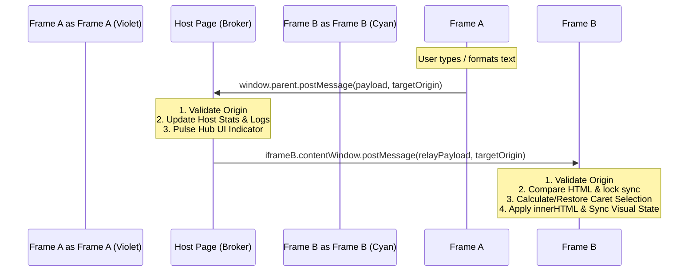

# EduChunks Engineering Intern Assessment

## Objective
**Bidirectional Rich Text Sync Across Iframes**

A high-performance, real-time, bidirectional rich text editor workspace. This project demonstrates synchronization between two isolated `iframe` editors via a central host broker, using the HTML5 Web Messaging API (`postMessage`). It operates completely on vanilla technologies with zero external runtime dependencies.

---

## Architecture Diagram



---

## Technical Architecture

The application is structured as a decoupled parent-child setup:

```
text/
├── index.html       # Central Message Broker, Logger & Statistics Host
├── editor.html      # contenteditable Rich Text Editor Instance
└── styles.css       # Shared Premium Glassmorphic / Cyberpunk UI Design
```

### 1. The Host Broker (`index.html`)
The host serves as the central hub. It contains:
- **Two isolated Editor Iframes**: Set up with distinct parameters (`editor.html?id=frame-a` and `editor.html?id=frame-b`).
- **PostMessage Routing**: Listens globally for message events, performs security validations, routes data payloads to destination frames, and updates metrics in real-time.
- **Transaction Logs**: Outputs JSON payloads of synced inputs, formatting options, and history changes. Includes filters to focus on specific categories (Inputs, Formats, and History).

### 2. The Editor Instance (`editor.html`)
Each iframe operates independently with:
- **WYSIWYG Toolbar**: Quick buttons for Bold, Italic, Strikethrough, Undo, and Redo.
- **Caret Preservation Core**: A precise character offset mapper that measures the absolute cursor coordinates relative to text nodes, allowing content updates without throwing the user's cursor to the start/end of the line.
- **History Tracker**: A custom stack-based Undo/Redo state machine tailored to rich text editing events.

---

## Features

### Core Implementation
* **Isolated Environment**: Two independent sandboxed iframes side-by-side.
* **Rich Editing Canvas**: Fully interactive HTML5 `contenteditable` editing environment.
* **Standard Styling Hooks**: Clean toggling for **Bold**, *Italic*, and ~~Strikethrough~~.
* **Robust Bidirectional Sync**: High-fidelity updates syncing modifications from Frame A to Frame B, and vice-versa, in real-time.
* **postMessage Middleware**: Host-brokered messaging structure preventing target coupling.
* **Infinite Sync Guard**: Prevents message loop cascades using value-matching checks and lock variables.

### Nice-to-Haves
* **Strict Security Handshakes**: Explicit origin validations to filter out rogue window/iframe events.
* **Visual Sync Ripple**: Instant CSS neon animations pulsing through the central hub representing routing activity.
* **Active Toolbar Indicators**: Contextual highlighting on formatting buttons based on current selection states (`document.queryCommandState`).

### Advanced Sync Engine (Bonus)
* **Real-time Input Debouncing**: Typings are debounced (50ms) to reduce message overhead and UI lag.
* **Preserved Caret Trajectories**: Cursor positions are calculated and restored seamlessly after DOM updates.
* **Undo & Redo State History**: Internal stacks capture state differences. Word boundaries (spaces, punctuation) trigger history snapshots.
* **Live Interactive Telemetry**: Filterable Transaction logs illustrating exact data packages exchanged across ports.

---

## Message Payload Structure

The `postMessage` protocol uses the following JSON schema:

```json
{
  "type": "INPUT_SYNC" | "FORMAT_SYNC" | "UNDO_REDO_SYNC",
  "action": "bold" | "italic" | "strikeThrough" | "undo" | "redo" | "",
  "html": "<p>Sample <strong>text</strong> content...</p>",
  "selection": {
    "start": 12,
    "end": 12
  },
  "source": "frame-a" | "frame-b"
}
```

---

## Core Synchronization Mechanics

### 1. Caret Location Tracking
When content updates across frames, the native browser behavior resets the caret to the start of the `contenteditable` block. To circumvent this, the editor tracks caret positions recursively across nested text nodes:
- `getSelectionCharacterOffsetWithin()`: Traverses child text nodes of the editor container, counting string lengths to find the absolute numeric `start` and `end` boundaries.
- `restoreSelection()`: Translates those boundary coordinates back into text nodes and DOM offsets to rebuild the exact `Range` and selection state.

### 2. Infinite Loop Prevention
To prevent message ping-pong between frames:
1. **Value Checks**: The target frame compares its current `editor.innerHTML` with the incoming `payload.html`. If they match, the update is skipped.
2. **Sync Lock Flag**: A boolean flag (`isSyncing`) locks input handling inside the target frame while applying external changes, preventing local triggers from firing nested sync cycles.

---

## Getting Started

### Local Setup
No compilation, bundling, or node modules are required. 

1. Clone or download this repository.
2. Open `index.html` directly in any modern browser.

### Security Note
When opening the files locally via `file://`, `window.location.origin` defaults to `"null"`. The code dynamically handles this setting to support local browser environments out-of-the-box. In production, edit the origin validation constraints in both `index.html` and `editor.html` to target your specific hosting domain.
